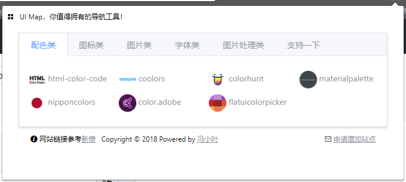
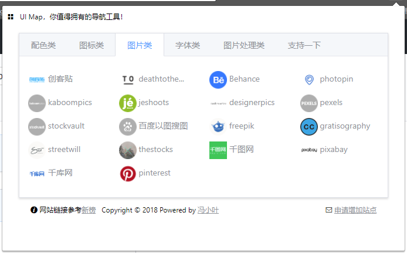
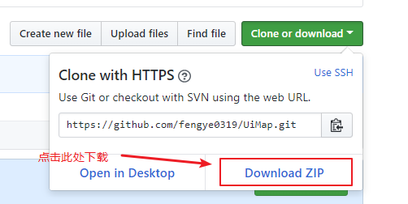
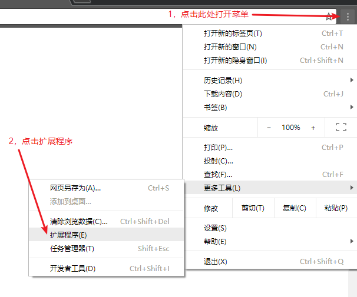
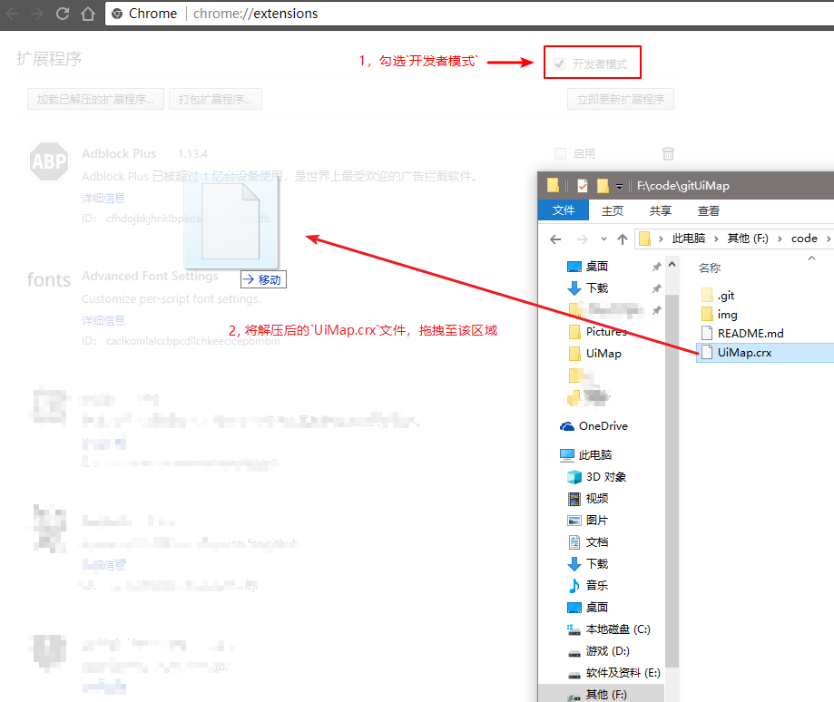
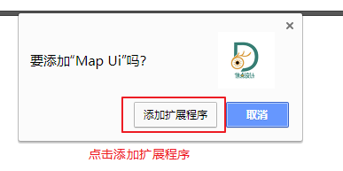
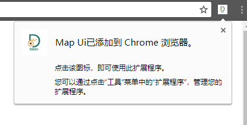

# Ui Map

为UI设计师准备的一站式导航，包含大量素材网站，你值得拥有...

## 预览

## 安装方法

**(目前仅支持Chrome)**

* 应用商城安装**（需要翻墙）**

> https://chrome.google.com/webstore/category/extensions

搜索 `Ui Map`，选择 `添加至 Chrome` 即可。

* 下载安装

> https://github.com/fengye0319/UiMap/archive/1.0.zip

或者点击：

* 解压下载的 `UiMap-*.zip` 文件包

* 打开 `Chrome` 浏览器

* 安装完成

## 支持作者

